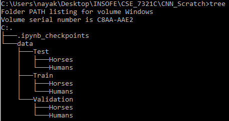
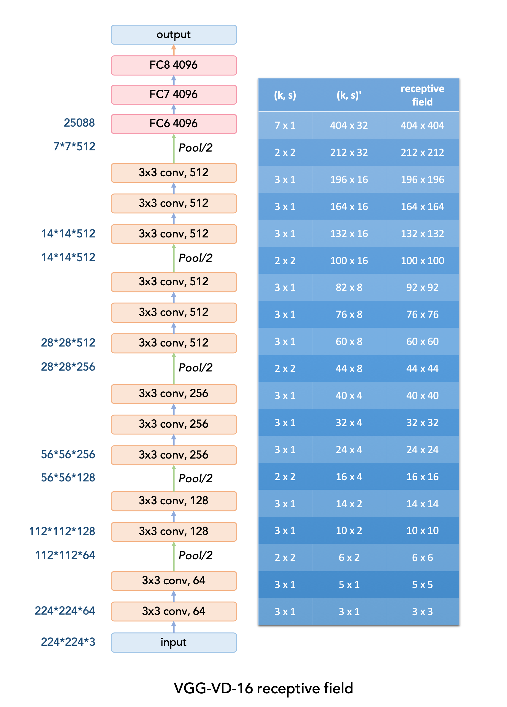
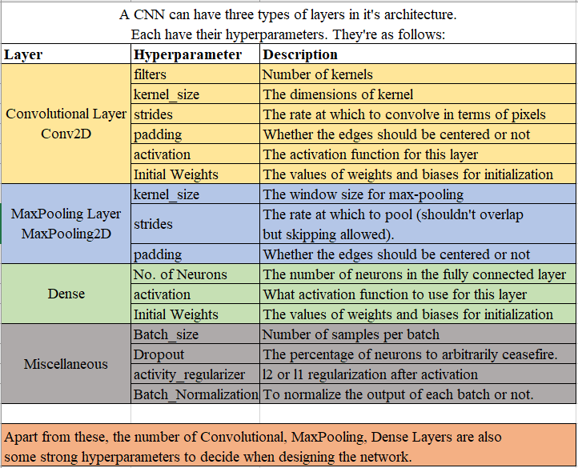

# Convolutional Neural Network with keras

In this repository, I have built Convolutional Neural Networks (which I'll hereafter mention with the abbr. form CNN) to perform image classification tasks on 

- A custom dataset to distinguish humans from horses
- A predefined dataset in keras (Fashion MNIST dataset)

# Agenda 
- To understand image preparation and preprocessing (some portion) with keras
- To build a simple CNN with Sequential API in keras
- To build a simple CNN with Functional API in keras
- Transfer Learning - To use previously defined model (VGG) in keras and tune them to suit our task.
- Image Augmentation using ImageDataGenerator in keras

# Image_Classification_Simple_CNN.ipynb
In this notebook, keep an eye out for the following important ideas:

- **Image Preparation**: `flow_from_directory` method of the `ImageDataGenerator` class can help us read images on the fly and feed them forward in the neural network. This needs us to define the directory structure of images in a particular way and also there are several other parameters which are explained in detail in notebook that help make the process quite simple. 

- **Model Architecture**: `Conv2D` and `MaxPooling2D` are two layers which help implement CNN in keras with ease. You can customize a lot of things in these two layers. Look for this subsection in the notebook to understand how we can define and use these layers in our CNN architecture.

- **Model Evaluation**: Since we have generator objects based on which we're verifying our data, it becomes important to note how we can evaluate the model on these generators using the `model.fit_generator()` method. Look out for them.

- **Image Augmentation**: Although in another notebook I go into the implementational part of it, this section in the notebook talks about the advantages and disadvantages of Image Augmentation and it's suitability specific to the task at hand.

# Image_Classification_VGG_16.ipynb 
Quite a few the steps in the above notebook i.e. Image_Classification_Simple_CNN are repeated in this notebook but the ones which are unique and need to be understood are:

- **Model Architecture**: The Visual Geometry Group from Oxford developed a model to classify a million images into a thousand classes and made the model available to us public to use for free. This model is mind-bogglingly impressive in the sense that it has it's weights and biases adjusted in a state of such an awesome local minima that it could be directly used with minor changes in the final layers (top layers) for getting astonishingly good results. Understand the architecture in terms of the different layers used.

*Image taken from google images*

- **Impact of Augmentation**: Although the previous book only touched on the idea of image augmentation, this book uses that idea and generates images by doing a lot of things - flipping them, shifting them, zooming them etc. and doing this to increase the size of our training data and making the network learn on these data helps improve performance from the status quo. Keras' `ImageDataGenerator` gives a lot of freedom and options to perform this augmentation. [Refer this link](https://keras.io/preprocessing/image/#imagedatagenerator-class) for more details on the same.

# Fashion_MNIST_classification_CNN.ipynb
In the previous two notebooks, we explored the use of Sequential API to build a model in keras. Here, we use the Functional API to achieve the same. **Model Building** part therefore differs in some aspect.

Also, keras needs images to be in a 3-Dimensional, (well technically 4-D) but each image to be a 3-Dimensional np array of width, height and channels. Being grayscale, this dataset doesn't have a third dimension. We have to do coerce the third dimension here. 

This notebook also touches upon the `flow` method of `ImageDataGenerator` class in order to pass images to the model as opposed to `flow_from_directory` method which didn't read any image but created and used images on fly as needed while feeding the network. 

The conclusion part explains why a simple CNN could perform well on this data inspite of having so many classes and a relatively small dataset for training the network on.

# Why CNN? Why CNN for images?

Unstructured data, especially images although they're high dimensional have a peculiarity: 

1. They've spatial information encoded in them. If we were to randomly shuffle pixels on a whim, the meaning conveyed by the image would be lost.

2. They predominantly have local correlations. There's a certain window size within which the pixel intensities show good correlation. A pixel in top left and bottom right for instance, in most cases don't have that much correlation (If image size is substantial).

Convolutional Neural Networks exploit these properties of image data in order to generate a neural network that is less interconnected than a Multi-layer Perceptron by only allowing Local Connections which not only learns generalized high level hierarchical features which allows them to perform better and not overfit but also saves a lot of computation since the number of connections become substantially lower. 

[This youtube video](https://www.youtube.com/watch?v=TJlAxW-2nmI) by Dr. Mike Pound gives a good high level intuition behind the working of a CNN.

# Tunable hyperparameters for a CNN

The following table shows a list of hyperparamters which we can tune for a CNN architecture to attain desired results. There may be some transfer learning specific hyperparameters also which aren't included here but for defining a CNN architectire on your own, these are sufficient.

Thanks for reading. Hope you liked the post. This [set of videos](https://www.youtube.com/playlist?list=PLZbbT5o_s2xrwRnXk_yCPtnqqo4_u2YGL) helped me a lot for building these notebooks. 
